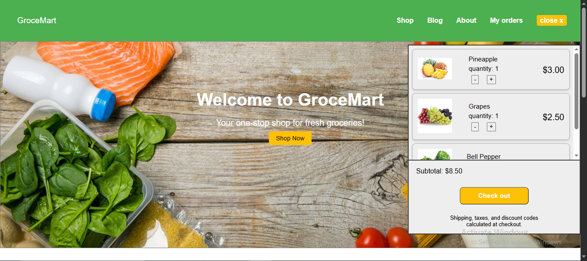

# 🛒 E-commerce Grocery Website

A sleek, modern grocery shopping website built for simplicity, speed, and a smooth user experience.
Designed to bring the convenience of a supermarket to your fingertips,
this front-end project lets users browse, add to cart, and prepare for checkout — just like a real online store.

## 🍉 Features

- 🧺 Add products to cart
- 💵 Dynamic cart updates with total calculation
- 🔍 Clean product listings and UI design
- 🧠 Modular and readable code structure

## 🛠 Tech Stack

- HTML5
- CSS3
- JavaScript (Vanilla)

## 📦 Installation

1. Clone the repository:
   ```bash
   git clone https://github.com/Laawigit/E-comerce-Grocery-web.git
   Open index.html in your browser to view the app.
   ```

🎯 Goals
This project was built to practice:

DOM manipulation

E-commerce logic (cart, quantity, pricing)

Clean UI/UX principles

🧠 What I Learned
Structuring an online store layout

Handling cart logic with plain JavaScript

Creating reusable HTML components

🖼 Screenshot


🚀 Future Improvements
Product filter by category or price

Checkout form with validation

Backend integration for real product data

Dark mode toggle 🌙

📮 Feedback
Got suggestions? Open an issue or drop a pull request — collaboration is always welcome.

👨‍💻 Author
Laawi — GitHub
